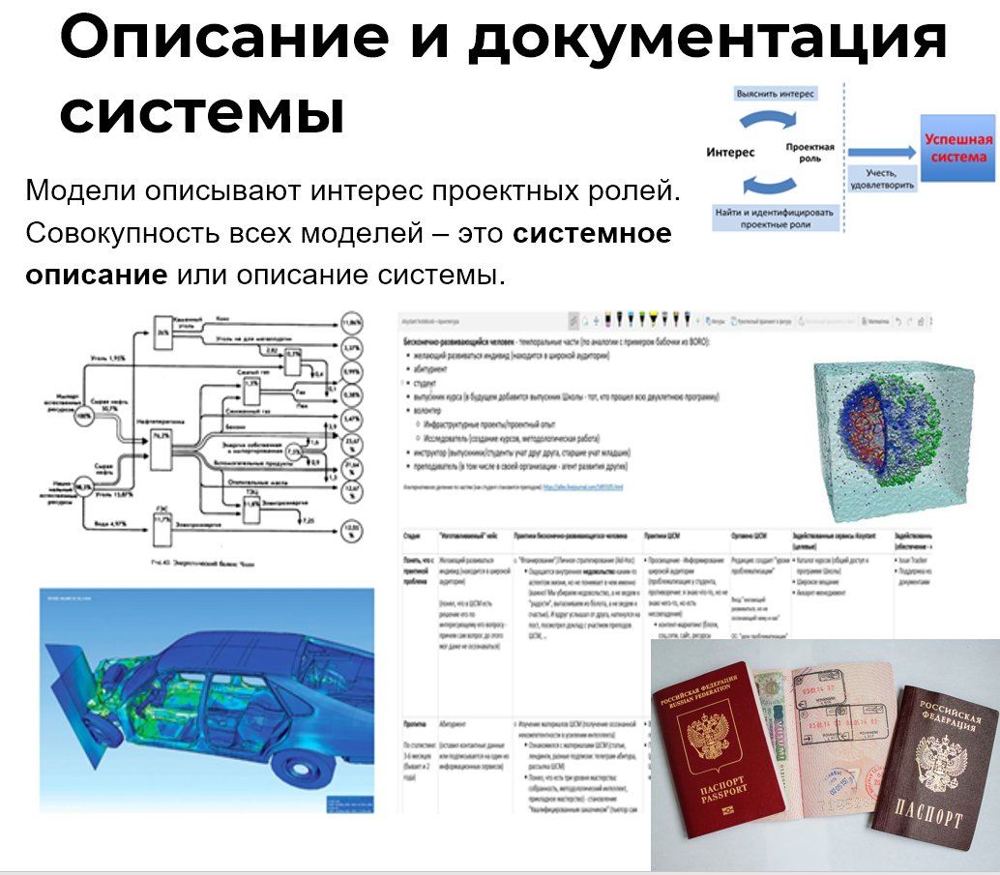

Давайте подробнее поговорим о документации. Вы уже знаете, что
**документация системы -- это описание системы на каком-то физическом
носителе.** Это может быть каталог запчастей, товарный буклет, модель
системы в компьютере, текст на бумаге. Обратите внимание, что по
словам^[Теперь всегда обращайте внимание на слова
собеседника. Например, как часто он использует слова из физического мира
или ментального пространства. Или что он сейчас хочет обсудить:
содержательный вопрос, форму оформления содержания или что-то
еще?] можно понять следующее: тут перечисляются объекты
физического мира -- буклет, модель в компьютере, бумага. Но, говоря о
носителях, мы ничего не сказали о содержании описания. Его можно
увидеть, прочитать, услышать и т. п. Оно характеризует систему по разным
параметрам^[По каким параметрам? По таким, которые
интересуют многочисленных заинтересованных лиц.].

Понятия «воплощение», «описание» и «документация» нужны, чтобы не
запутаться в рассуждениях о системе. Эти понятия управляют вниманием,
помогают обсуждать каждый аспект отдельно, а не сваливать всё в
кучу^[Нашему мозгу не хватит вычислительной мощности,
чтобы обсуждать систему сразу в нескольких разрезах. А кроме того,
данные понятия могут интересовать разные роли.]. Давайте
разберем пример. **Системой может быть человек как биологическое
существо**. Он является объектом физического мира и находится \"во
плоти\", то есть система «человек» буквально воплощена в реальности. У
неё есть многочисленные описания, например, рост, вес, цвет волос и
кожи, и т.п. Ещё есть описание в виде фамилии, имени и отчества.

Когда мы говорим про описания, то понимаем, что они не находятся в
физическом мире. Называя человека по имени, мы упоминаем описание
человека. Оно находится в ментальном пространстве. Но также есть
документация системы: свидетельство о рождении, паспорт, загранпаспорт,
водительское удостоверение и так далее. В этих документах содержится
определённое описание системы «человек». **Документы представлены в
физическом мире, и в них содержится
описание**^[Содержательная характеристика
системы.]**, которое интересует какие-то проектные
роли**. Например, водительское удостоверение интересует автоинспектора.
Если бы не было данных интересов, то не было бы описания, и не нужно
было бы делать данную документацию.

Точно такое же деление на воплощение, описание и документацию системы
можно делать в отношении неодушевленных объектов. Возьмём для примера
молочный коктейль. С одной стороны, сам этот напиток в физическом мире и
есть воплощение системы. При этом у этого коктейля есть разные описания:
название, рецепт и т.п. И есть документация системы на бумажном
носителе, где указано название и состав, а ещё есть документация в виде
меню с фото и ценой напитка.

**Описаниями называют** **определённые** **характеристики или свойства
системы.** Этой информации нет в реальном мире. Например, нельзя
сказать, что возраст человека «42 года» находится где-то в физическом
мире и имеет собственную длину-ширину-высоту-время (4D-измерение). Вы
можете указать на человека, но это тогда будет воплощение системы. Вы
можете указать на число «42» в физическом мире, только если оно
находится на конкретном носителе информации.

Итак, **документация может быть представлена** в форме ИТ-модели, схемы,
таблицы, текста на бумаге или в компьютере. То есть, когда мы говорим
«документация», значит обращаем внимание на носитель информации. Он
является приоритетом в обсуждении до тех пор, пока в разговоре не
появятся слова «воплощение» или «описание».

**Описания могут быть неформальными и формальными**. Большинство людей
не осознают важность формальных описаний, и довольствуются только
неформальными. В сложных проектах, когда мы работаем с многочисленными
интересами, необходимы именно формальные описания: созданные по
какому-то методу и положенные на носитель. Они помогают разобраться в
предмете интереса, поскольку, начиная делать описания, лучше понимаешь
заинтересованных лиц. Неформальные описания часто остаются в головах
людей и за ними может не стоять формального метода описания. Многое из
того, что просто прикинули в голове, забывается.

Как мы уже говорили ранее, формальные описания предметов интересов
создаются определенными **методами описания** **(практиками)**. В методе
описания существует понятийный минимум и принципы. Об этом
рассказывается на курсе «Рациональная работа». Системное мышление
опирается на знание онтологики (онтология и логика), поэтому в системном
описании необходимо уметь читать и создавать разные модели системы, а
также работать с моделями, понятными компьютеру.

Чтобы создать успешную систему необходимо удовлетворить определенные
ролевые интересы. А это удовлетворение происходит через составление
моделей, которые отвечают выбранным предметам интересов к системе.
Именно поэтому нам так важно разобраться в описаниях системы. **Чтобы
воплотить успешную систему в реальности,** **необходимо поработать с
описаниями системы**. А они зависят от предметов интересов проектных
ролей.

**Большинство из вас работает с многочисленными описаниями систем.**
Попробуйте составить в таблицах на моделировании список документов,
которые вы создаёте или в создании которых участвуете, либо документов,
сделанных вашими коллегами, которыми вы пользуетесь в процессе работы.
Сопоставьте каждый документ с системой, которую он описывает. Кроме
того, подумайте о том, какие системы описаны в стратегии развития вашего
предприятия или в другом подобном документе.

Несмотря на то, что современные офисные сотрудники работают с
описаниями, необходимо не упускать из внимания физический мир. Всегда
ищите воплощения системы. Системное мышление, в первую очередь, про
физический мир, хотя оно и имеет дело с описаниями. Как написано в
учебнике А. Левенчука «**описания ничто, а вот описанное ими ---
всё**!». Все описания делаются только ради того, чтобы менять описанное
в физическом мире!
