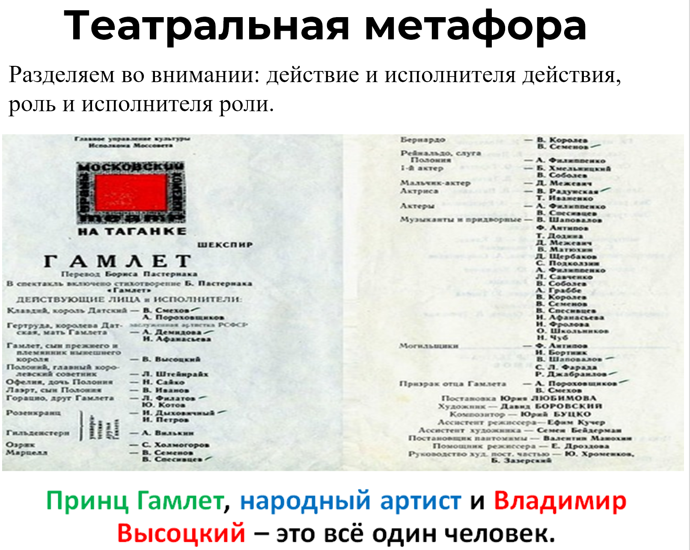

Для того, чтобы понять, что такое «роль» обратимся к театру. Всем
известна фраза «Вся жизнь -- театр, а люди в нем актеры». Эта фраза
тянет не только на философское признание, она пригодится и в системном
мышлении.

Театральная метафора помогает объяснить разницу между действием и
исполнителем действия или между **ролью и исполнителем
роли**^[При этом не стоит думать, что Я -- это множество
ролей. Я -- это исполнитель какой-то конкретной роли в конкретной
ситуации или проекте. Но я также владею мастерством для того, чтобы
играть множество разных ролей.]**.** В театре различают
исполнителя Владимира Высоцкого^[Роль Гамлета может
исполнять Иван Иванович, игра которого просто меркнет перед талантом В.
Высоцкого. Однако, оба исполнителя всё же играют роль Гамлета, хотя у
них разные квалификации. Поэтому мы будем отдельно говорить о ролях и об
исполнителях. Роль одна и та же, а исполнители могут быть
разными.] и роль, которую он играет. Это понимают даже
малые дети. Но взрослые люди подчас не осознают, что сами играют роли
«менеджера» или «инженера».

В театре один и тот же актер может играть разные роли, а на действия
любого человека можно посмотреть с точки зрения понятия «роль». Можно
сказать, что каждый человек играет роли в личной жизни или в рабочих
проектах. Только не каждый задумывается об этом.

**Мы осознанно обращаем внимание на свои действия, только** **когда
хотим улучшить свое поведение**. Если нам не нужно ничего менять в своём
мышлении или в рабочих практиках, то нет необходимости и в ролевом
рассмотрении. Однако, если нам важно изменить принцип работы отдельного
человека или целой команды, то лучший на сегодня вариант это сделать --
использовать понятие «роль», а также другие понятия, которые с ним
связаны -- «метод (практика)» и «рабочий продукт».

В театре действия по роли четко определены сценарием, а исполнители
могут регулярно меняться. В жизни точно так же: роль хирурга могут
играть разные люди. Но любой хирург действует исходя из определенной
медицинской практики, которую изучал в вузе. Понятие «роль» неразрывно
связано с понятием «метод (практика)»: как только мы переходим в ролевое
рассмотрение, мы должны будем обсуждать и ролевые
практики^[А также рабочие продукты, системы и многое
другое. Системное мышление вводит определенные понятия и показывает, как
они связаны между собой.].

Итак, **роль**^[Понятие «роль» имеет синонимы -- ролевой
или функциональный объект.] -- это какое-то устоявшееся в
культуре название: хирург, футболист, водитель,
молоток^[Вспомните рассмотрение «молотка» из предыдущего
раздела.] или автомобиль, и т.п. Роль исполняет
определенный агент, которого мы называем **исполнителем роли.** Из
театральной метафоры и от человека-актера мы переходим к более
фундаментальному рассмотрению, где исполнителями ролей могут быть не
только люди, а, например, другие агенты (например, искусственный
интеллект, или команда, или целое предприятие) или любой неодушевлённый
предмет (хоть камень).

Действия агента по роли -- это ролевое поведение**,** которое
совершается по определенным правилам или с помощью определенного
**метода (практики).** Исполнители ролей с помощью практик создают
**рабочие продукты**. Разберём подробнее следующее:

-   понятие роль относится не только к человеку, хотя мы и начинали
    разбираться с этим понятием через театральную метафору;
-   роли не у человека, а человек в роли участвует в какой-то
    деятельности (процессе) или является частью системы;
-   исполнителем роли необязательно является человек, и поэтому мы будем
    говорить об агенте как исполнителе роли или о неодушевленном
    объекте;
-   агентами могут быть как люди;
-   от ролей и их интересов зависит успешность системы;
-   роли исполняют практику и создают рабочие продукты.
