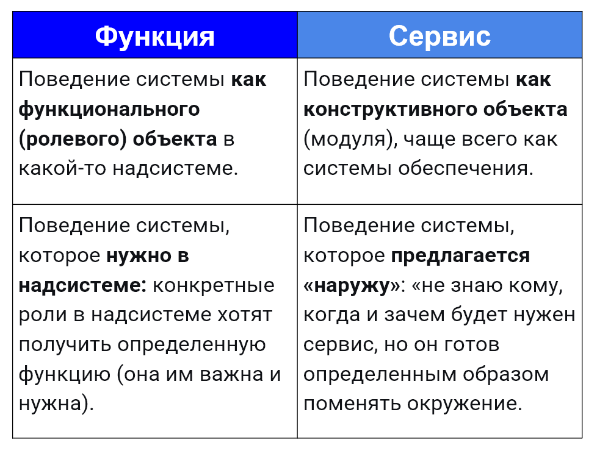

**Целевую** **систему** **замысливают** **как поставляемый продукт
(физический объект).** Такая система обычно изготавливается командой
проекта из закупаемого этой командой сырья, а затем физически
поставляется потребителю. И уже у потребителя этот продукт выполняет
запрошенную функцию, действуя в составе надсистемы в ходе эксплуатации.

Например, вы производитель часов, и для вас часы -- это целевая система.
Клиенты используют ваши целевые системы двумя способами:

-   первый -- в составе своей целевой системы. Например, ваши
    часы-продукт клиент устанавливает в свой автомобиль-продукт, а затем
    продаёт автомобиль своему клиенту, и часы показывают время в ходе
    эксплуатации автомобиля;
-   второй -- клиент использует часы в составе системы создания своего
    продукта автомобиля (автомобиль -- продукт вашего клиента).
    Например, ваши часы-продукт клиент устанавливает в свой цех на
    стену, чтобы рабочие во время сборки автомобиля могли следить за
    временем в ходе работы.

**Альтернативный вариант --- торговать не системами-продуктами, а
сервисами**. Условно, вы можете по запросу отправлять точное время.
Возможно, что для автомобиля и для цеха часы-продукт будут более
предпочтительны, чем такой сервис как предоставление информации о точном
времени по запросу. Но есть давно всем известный пример сервиса ---
такси. Можно продавать автомобиль-продукт, а можно -- сервис перевозки.

Для того, чтобы предоставить сервис, вам нужно сделать систему, которая
будет производить данный сервис. При этом вы не продаете систему, клиент
платит вам за предоставленный сервис. Если мы берем пример с
автомобилем, то он является продуктом. Можно продать автомобиль, чтобы
клиент сам исполнял роль водителя, и он же также являлся пассажиром. То
есть он сам себя везет. Но можно предложить клиенту сервис перевозки, и
в этом случае клиент исполняет только роль пассажира. Ваша система,
которая организовывает сервис перевозки, состоит, как минимум, из
автомобиля и водителя в лице вашего сотрудника.

Обычно сервис предлагает система создания, то есть предприятие. Хороший
пример -- это гостиничный сервис. Есть гостиница, которая оказывает
услуги пребывания, ночёвки.

**Сервис --- это поведение, работа, услуга.** А оказывает его сервисное
предприятие или система: сервисное оборудование, сервер, служба,
провайдер. Чувствуете разницу в словах?

Давайте вспомним, что поведение системы мы ещё называли функцией. **По
своей природе функция и сервис не отличаются. Это всё поведение
системы** (функциональное или ролевое). Но для чего нужны два разных
понятия?

Всё дело в том, что это разный сленг, который свойственен двум разным
видам рассмотрения. Термин «функция» используют внешние проектные роли,
которые хотят получить определенное поведение в надсистеме. Мы говорим,
что функцию системы назначают извне, она нужна в надсистеме. А термин
«сервис» используют внутренние проектные роли, которые создают систему,
которая как бы выдаст наружу сервис. А вот **станет ли выданный сервис
запрошенной функцией**? От этого и будет зависеть успех.

Итак, термин **«сервис» -- это взгляд от системы** **на** **её
окружение. Обратный взгляд, со стороны окружения/надсистемы** **на**
**систему** **-- это функция.** И вполне может быть, что функция может
носить другое имя. Сервис забития гвоздя может оказаться функцией
скрепления досок. А сервис насасывания воды может стать функцией
нагнетания антифриза.

Функция --- это поведение системы со стороны надсистемы, когда клиентам
зачем-то нужна конкретная функция. Сервис --- это поведение системы со
стороны её разработчика, когда он говорит «не знаю зачем нужно, но могу
поменять определенным сервисом окружение (мир)». Или термин функция
можно использовать, чтобы рассматривать поведение системы в
надсистеме^[Или подсистемы в системе.]
как функционального или ролевого объекта. А термин сервис, чтобы
рассматривать поведение системы в надсистеме как конструктивного
объекта. Чаще всего сервис обозначает поведение системы создания,
которая воздействует на целевую систему.

Так что не удивляйтесь, когда про один и тот же предмет, один и тот же
продукт и одно и то же его поведение вы услышите два совсем разных
разговора: это специфика разных интересов.

Часто клиенты могут сказать, что предоставленный сервис их не
устраивает. Это означает, что клиенты ожидают получить определенную
функцию, но качество оказания сервиса не соответствует их ожиданиям.
Например, вы проводите ночь в гостинице. Вам необходимо выспаться,
помыться и т.п. Это одно рассмотрение. И оно происходит в терминах
потребностей и функций. А есть рассмотрение со стороны управляющего и
других ролей, которые проектируют и управляют гостиницей. И вот тут
управляющая команда рассматривает сервисы, которые предоставляются
постояльцам. Если подсистемы и вся гостиница в целом спроектированы
плохо^[Например, плохо изучены потребности целевой
аудитории гостиницы.], то возникают жалобы на качество
обслуживания. Клиенты не могут критиковать свои запросы (то есть не
используют сленг по функциям), поэтому критикуют на языке управляющей
компании --- говорят, что именно сервис^[Как мы знаем
термином «сервис» оперирует команда создания.]
никудышный.

Необходимо понимать, что производители и сервис-ориентированные
**компании хотят называть свои системы-продукты и сервисы так, чтобы
потенциальные покупатели быстро** **видели в них** **свои функциональные
запросы.** А вот насколько это удается, определяет рынок.

В этой связи компаниям важно правильно позиционировать свои сервисы,
чтобы ими случайно не воспользовались люди из не целевой аудитории.
Например, если ШСМ будет предлагать свои текущие образовательные сервисы
школьникам или любителям легкого обучения, то мы однозначно получим
обратную связь о некачественном обучении.
