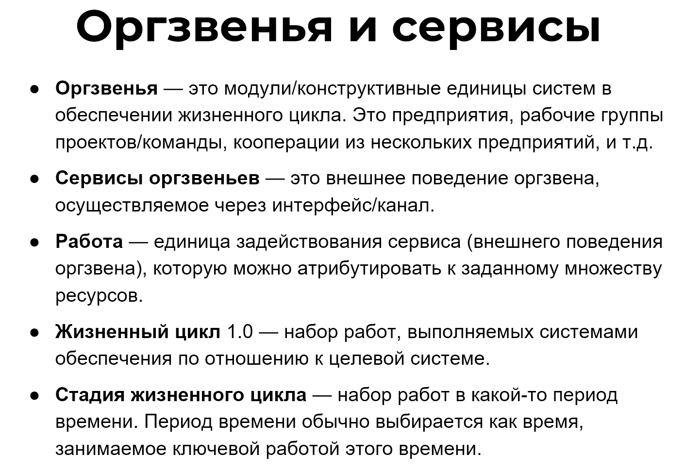

Работы реализуют **оргзвенья**. Оргзвено --- это агенты (люди,
организации, AI) с материалами и оборудованием, находящимся в
распоряжении этих агентов. Минимальное оргзвено -- это один сотрудник,
принятый на определенную должность и распоряжающийся соответствующими
ресурсами.

Чаще всего оргзвенья не инициируют работы сами. В коллективной
деятельности одни оргзвенья имеют полномочия поручать работу другим, у
которых есть обязанности такие просьбы выполнять. Вся совокупность
оргзвеньев со взаимными полномочиями --- это и есть **организация**.
Целевую систему может создавать расширенное предприятие, в состав
которого может входить несколько организаций. То есть юридическое или
организационно-правовое разделение -- это одно из возможных описаний
системы-создателя.

Каждое оргзвено осуществляет внешнее поведение, которое мы называем
**сервисом**. Например, есть оргзвено на предприятии, которое начисляет
зарплату, а есть оргзвено, которое её выдаёт. То есть это сервисы
начисления и выдачи. А есть еще сервисы сборки, например сборки
автомобиля. Оргзвенья могут оказывать сервис другим оргзвеньям или же
целевой системе^[Например, сервис сборки
автомобиля.].

Работа появляется, когда оргзвену дают поручение и оно получает
необходимый ресурс. Далее оргзвено выдает необходимый сервис, в
результате которого получается **рабочий продукт**. Пока нет поручения
или ресурсов, сервис не оказывают или работу не делают.
